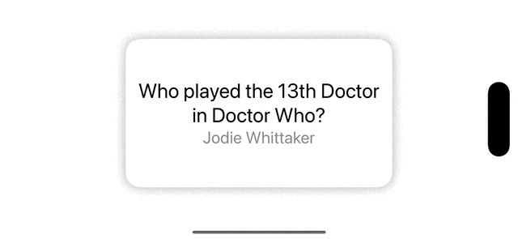
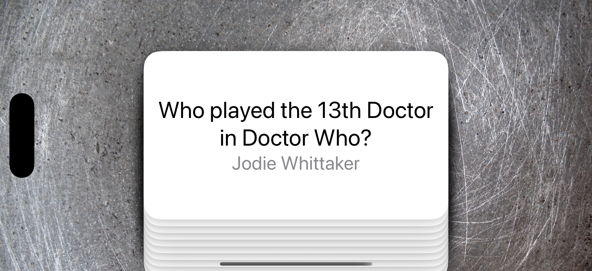

# Flashzilla

## Paul Hudson's ([@twostraws](https://x.com/twostraws)) 100 Days of Swift UI Project 17

Source URL: [link](https://www.hackingwithswift.com/books/ios-swiftui/flashzilla-introduction)

>In this project we’re going to build an app that helps users learn things using flashcards – cards with one thing written on such as “to buy”, and another thing written on the other side, such as “comprar”. Of course, this is a digital app so we don’t need to worry about “the other side”, and can instead just make the detail for the flash card appear when it’s tapped.

_Note: In this project, I chose to go with less branches and a shorter Read Me, focusing only on what I've found interesting or important for my own projects. One can always refer to Paul's original tutorial (always recommended) for a complete explanation._

### Gestures in SwiftUI

Examples of gestures _(note: it doesn't work well in the simulator)_:

```swift
import SwiftUI

struct ContentView: View {
    @State var tapMessage = "Tap to start!"
    @State var gestureChangedMessage = "This triggers whenever the gesture changes!"
    @State var scaleMessage = "Scale gesture!"
    @State var currentAmount = 0.0
    @State var finalAmount = 1.0
    @State var rotationMessage = "Rotation gesture!"
    @State var currentAngleAmount = Angle.zero
    @State var finalAngleAmount = Angle.zero
    
    var body: some View {
        Spacer()
        
        Text(tapMessage)
            .onTapGesture(count: 2) {
                tapMessage = "You tapped 2 times"
            }
            .onLongPressGesture(minimumDuration: 2) {
                tapMessage = "You pressed long for 2 seconds"
            }
        
        Spacer()
        
        Text(gestureChangedMessage)
            .onLongPressGesture(minimumDuration: 1) {
                gestureChangedMessage = "Long press gesture started!"
            } onPressingChanged: { inProgress in
                gestureChangedMessage = ("In progress: \(inProgress ? "Long pressing": "Long pressing ended")")
            }
        
        Spacer()
        
        Text(scaleMessage)
            .scaleEffect(finalAmount + currentAmount)
            .gesture(
                MagnifyGesture()
                    .onChanged { value in
                        self.currentAmount = value.magnification - 1
                    }
                    .onEnded { value in
                        finalAmount += currentAmount
                        currentAmount = 0
                    }
            )
        
        Spacer()
        
        Text(rotationMessage)
            .rotationEffect(currentAngleAmount + finalAngleAmount)
            .gesture(
                RotateGesture()
                    .onChanged { value in
                        self.currentAngleAmount = value.rotation
                    }
                    .onEnded { value in
                        finalAngleAmount += currentAngleAmount
                        currentAngleAmount = .zero
                    }
            )
        
        
        Spacer()
    }
}

#Preview {
    ContentView()
}
```

### Single CardView

Source URL: [link](https://www.hackingwithswift.com/books/ios-swiftui/designing-a-single-card-view)

Result:

<div align="center">
  
</div>

### Building a stack of cards

Source URL: [link](https://www.hackingwithswift.com/books/ios-swiftui/building-a-stack-of-cards)

I've found this `extension` for stacking cards really interesting:

```swift
extension View {
    func stacked(at position: Int, in total: Int) -> some View {
        let offset = Double(total - position)
        return self.offset(y: offset * 10)
    }
}
```

And here's the code...

```swift
ZStack {
    Image(.background)
        .resizable()
        .ignoresSafeArea()
    VStack {
        ZStack {
            ForEach(0..<cards.count, id: \.self) { index in
                CardView(card: cards[index])
                    .stacked(at: index, in: cards.count)
            }
        }
    }
}
```

... that creates the end result below:

<div align="center">
  
</div>

### Challenge 1

Source URL: [Flashzilla Wrap Up](https://www.hackingwithswift.com/books/ios-swiftui/flashzilla-wrap-up)

Branch: `challenge-01`

>When adding a card, the text fields keep their current text. Fix that so that the textfields clear themselves after a card is added.

This problem was solved by simply setting the two state variables back to an empty string value after adding (and saving) the card as below:

```swift
func addCard() {
    let trimmedPrompt = newPrompt.trimmingCharacters(in: .whitespaces)
    let trimmedAnswer = newAnswer.trimmingCharacters(in: .whitespaces)
    guard trimmedPrompt.isEmpty == false && trimmedAnswer.isEmpty == false else { return }

    let card = Card(prompt: trimmedPrompt, answer: trimmedAnswer)
    cards.insert(card, at: 0)
    saveData()
    
    // Challenge 1 solution below
    newPrompt = ""
    newAnswer = ""
}
```

## Acknowledgments

Original code created by: [Paul Hudson - @twostraws](https://x.com/twostraws) (Thank you!)

Made with :heart: by [@cewitte](https://x.com/cewitte)
